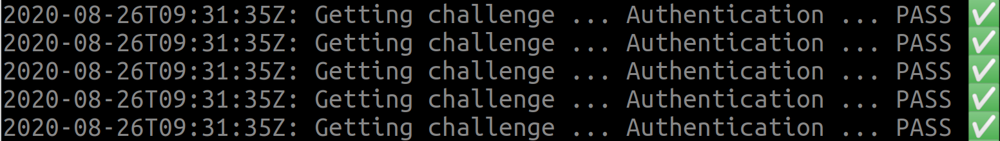
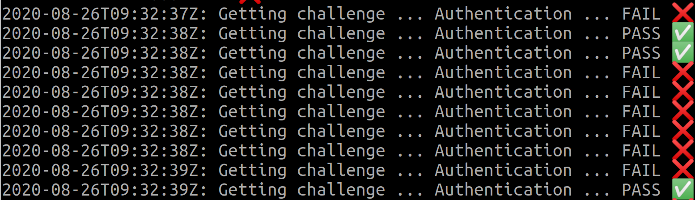

Imagine the following situation. You are working in a regulated environment, such as [healthcare](https://elastisys.com/hipaa-compliance-kubernetes-privacy-rule/). You want to make sure that your user's passwords are safe, hence you use [Secure Remote Password protocol (SRP)](https://en.wikipedia.org/wiki/Secure_Remote_Password_protocol) for authentication. In brief, SRP does not require the client to send the password to the server, nor the server to store the password. Instead, a sophisticated exchange allows the client to prove to the server that it knows the password. Similarly, the client can verify that the server knows the password.

## Running on Kubernetes

The SRP server of your company was coded years ago. Let us run it on top of Kubernetes:

```
git clone https://github.com/elastisys/tutorial-friends-with-kubernetes
cd tutorial-friends-with-kubernetes/code
```

!!!note
    To simplify this tutorial, the `srp-server` includes a hard-coded database with a single test user.

Thanks to the magic of ready-made tutorials, the Dockerfile and Kubernetes resources are already written.

!!!note
    To simplify this tutorial, you will build the container image directly inside the Docker Daemon of Minikube. Usually, you should push container images to a registry.

```
eval $(minikube docker-env)
docker build -t srp-server srp-server
kubectl apply -f srp-server/deploy

kubectl get pods
```

Awesome! The SRP server seems to work. That was really easy. Let's check if it can actually perform logins:

```
eval $(minikube docker-env)
docker build -t srp-client srp-client
kubectl run \
    -ti \
    --rm \
    --generator=run-pod/v1 \
    --image srp-client \
    --image-pull-policy Never \
    srp-client \
    http://$(minikube ip)
```



You should see a screen full of green checkboxes. Great success!

## Trouble Ahead: Scaling Does Not Work

The world is now a different place and your healthcare application is getting popular. Time to scale the SRP server up.

Leave `srp-client` running and in a new terminal type:

```
kubectl scale --replicas=2 deployment/srp-server
```

And, as you wait for `srp-server` to scale up ...



... Auch! That does not look too good! Authentication failures are littering your terminal.

Scared you scale the application back down. However, you feel the sour taste of Kubernetes failing its promise to facilitate scalability.

## What Happened?

Let us look closer at SRP. The sequence diagram from [simbo1905](https://github.com/simbo1905/thinbus-srp-npm) explains it best:


One item stands out: the challenge cache! Aha! The server needs to store some state between issuing a challenge and authenticating the client. It cannot trust the client to store this information, as this would void the security guarantees of SRP.

But wait! If `srp-server` is scaled to two replicas, what happens to the challenge cache? A quick inspection of `code/srp-server/srp-server.go` reveals that the challenge cache is local to each replica:

```
var authSessionCache = map[string](*srp.SRPServer){}
```

As Kubernetes tries to balance the load across replicas, the likelihood of the client getting the challenge from one replica and authenticating against a different replica is high.

!!!note "Nobody makes such an obvious mistake!"
    You might argue that this is a constructed problem, a mistake we sneaked in just to give purpose to this tutorial. And, of course, this is a minimal not-so-working example, so it may feel a bit artificial. But trust me! Our customers constantly bump into this. As legacy code is exposed to new situations, hidden behind layers and layers of libraries, state creep is a real barrier to Kubernetes adoption.

There are several solutions to this problem:

1. Push the state to the client: Given the nature of SRP, you would need to use [authenticated encryption](https://en.wikipedia.org/wiki/Authenticated_encryption) for that. The downside is that you need to change the client-server API.

2. Sticky sessions or static source-IP load-balancing: This ensures that the client asks for a challenge and authenticates against the same replica. This is a quick fix, but will brings more issues down the road with scaling down, rolling updates, etc.

3. Share the challenge cache: This ensures that each replica has access to the same challenge cache.

Let's go for the last solution. It requires no API changes, and will prepare us for scaling down and rolling updates.

## Moving the Challenge Cache to Redis

[Redis](https://redis.io/) is a popular project in the cloud native ecosystem to store short-lived ("cache") state. While pushing state out of your service into ... another service may feel like cheating, Redis is well equipped to handle state: It supports multiple replicas, with proper state replication and fail-over. Of course, your service could implement such state handling too, but by the time you are done you essentially have *an ad hoc, informally-specified, bug-ridden, slow implementation of half of Redis*. ([Greenspun's tenth rule](https://en.wikipedia.org/wiki/Greenspun%27s_tenth_rule) for cloud native software?)

Assuming I convinced you, let's spin up a Redis cluster:

```
helm repo add bitnami https://charts.bitnami.com/bitnami
helm install redis bitnami/redis
```

Now let's change the application to store the challenge cache in Redis. Thanks to the magic of tutorials, the source code is already available in `srp-server-redis`. I here assume that you are able to read Go code, although you are not required to be a Go programmer to understand this part. I suggest you look at the changes using side-by-side diff:

```
diff --exclude 'go.*' -ru srp-server srp-server-redis | less -S
```

Let us here briefly discuss the main changes. First, we replaced the `authSessionCache` global variable with a Redis client (see `srp-server.go`), which we use to set and get challenge caches. We took the opportunity to set an expire of 1 minute to each entry, something that the previous code didn't have. (How come the old `srp-server` didn't crash due to memory exhaution until now?)

Second, we changed the Deployment to expose the Redis password (i.e., a Secret) and the Redis server address to `srp-server-redis` via environment variables.
This is a very common pattern for configuring applications hosted in Kubernetes.

So, does it work?

```
eval $(minikube docker-env)
docker build -t srp-server-redis srp-server-redis
kubectl apply -f srp-server-redis/deploy
kubectl get pods
```

The client shows all green with a single `srp-server-redis` replica, but did we solve the original problem of scaling up?

```
kubectl scale --replicas=3 deployment/srp-server
```

Great! We now have a service that we can properly scale up with zero downtime.

## Takeaways

* Kubernetes promises to solve issues, such as scalability, fault-tolerance and zero-downtime updates.
* To solve these issues, Kubernetes has certain expectations from the hosted application.
* One of these expectations is for the application to be stateless. State must be stored in services that can handle state with care.
* As legacy code is reused in new situations, state may creep into what we may believe is a stateless application.
* Redis is a popular project to store short-lived "cache" state.

But how do I detect state creep before it's too late? **Practice the rule of two.** Always have at least two replicas of every code.
